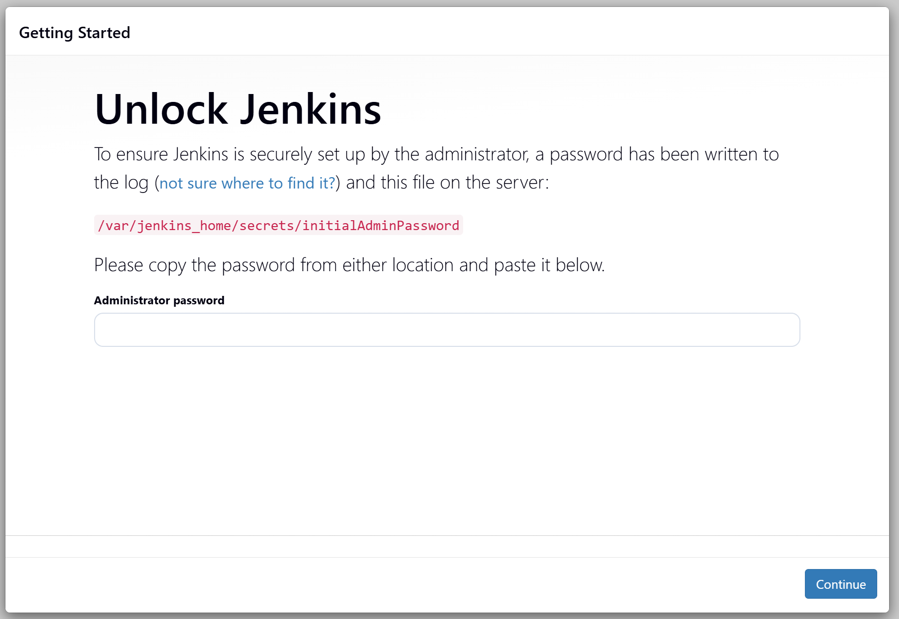
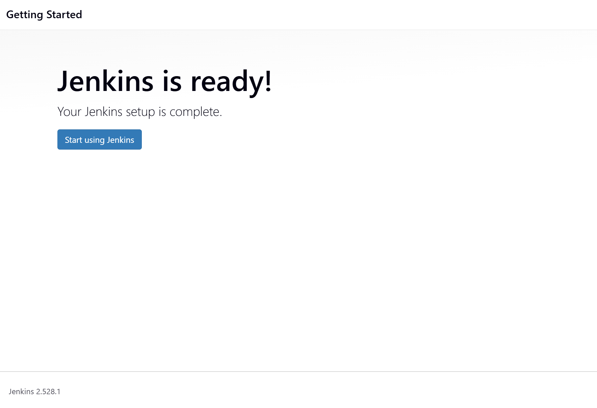
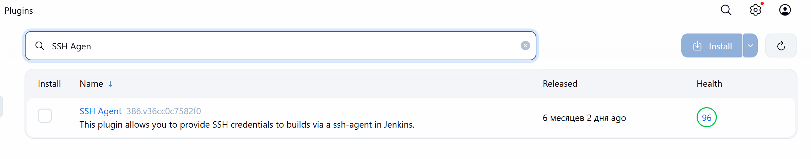
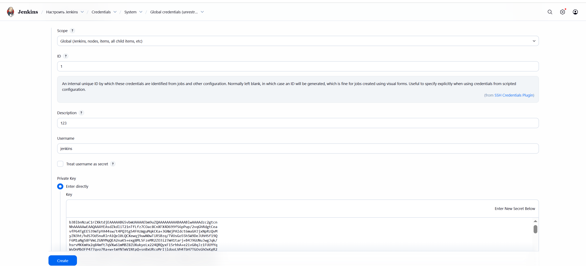
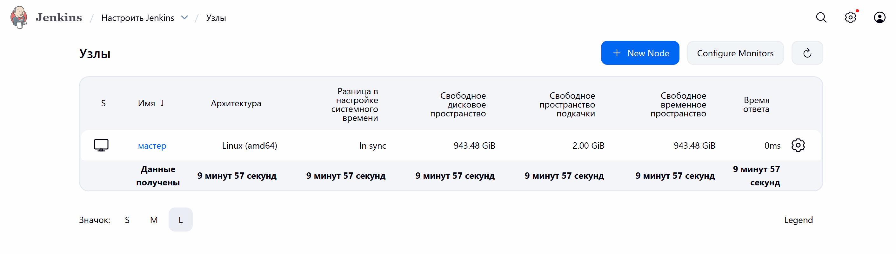
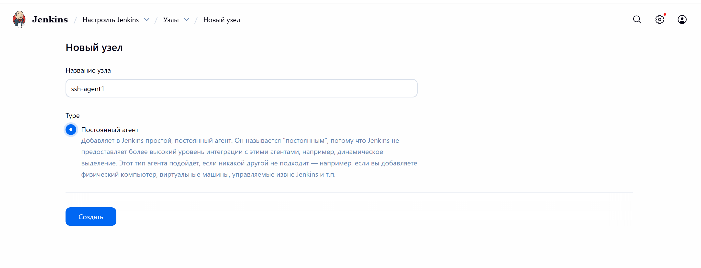
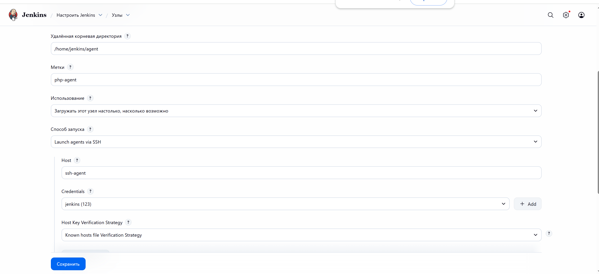

# Лабораторная работа 4
# Студент: Gachayev Dmitrii, I2302
# Дата выполнения: 11.11.2025
# Цель
Научиться настраивать Jenkins для автоматизации задач DevOps, включая создание и управление конвейерами CI/CD.

---

## Подготовка контроллера Jenkins
1. Создаю следующий `docker-compose.yml`:
```
services:
  jenkins-controller:
    image: jenkins/jenkins:lts
    container_name: jenkins-controller
    ports:
      - "8080:8080"
      - "50000:50000"
    volumes:
      - jenkins_home:/var/jenkins_home
    networks:
      - jenkins-network

volumes:
  jenkins_home:
  jenkins_agent_volume:

networks:
  jenkins-network:
    driver: bridge
```
и запускаю его:
```bash
docker compose up -d
```

2. Перехожу на localhost и настраиваю `Jenkins`:



Получаю пароль:
```bash
docker exec -it jenkins-controller 
cat /var/jenkins_home/secrets/initialAdminPassword
```

Выбираю рекоммендованную установку  завершаю настройку:



## Подготовка SSH агента

1. Создаю папку `secrets` и добавляю туда ssh ключи:
```bash
mkdir secrets
cd secrets
ssh-keygen -f jenkins_agent_ssh_key
```

2. Создаю  `Dockerfile` для SSH агента с следующим содержимым:
```dockerfile
FROM jenkins/ssh-agent

# install PHP-CLI
RUN apt-get update && apt-get install -y php-cli
```

3. Добавляю в `docker-compose.yml` следующее:
```
  ssh-agent:
    build:
      context: .
      dockerfile: Dockerfile
    container_name: ssh-agent
    environment:
      - JENKINS_AGENT_SSH_PUBKEY=${JENKINS_AGENT_SSH_PUBKEY}
    volumes:
      - jenkins_agent_volume:/home/jenkins/agent
    depends_on:
      - jenkins-controller
    networks:
      - jenkins-network
```
4. Создаю `.env` файл и помещаю в него публичный ssh ключ.

## Подключение SSH агента к Jenkins
1. Устанавливаю плагин `SSH Agent`:



2. Перехожу в Manage Jenkins > Manage Credentials, добавляю Credentials:


Выбираю `SSH Username with private key`, добавляю приватный ключ и ввожу остальные поля:



3. Добляю новый узел агента `Jenkins`:







## Создание конвейера Jenkins для автоматизации задач DevOps

1. Копирую сайт из 8 лабораторной работы по контейнеризации в репозиторий.

2. Добавляю строку с запуском файла с тестами в `Jenkinsfile`:
```
pipeline {
    agent {
        label 'php-agent'
    }
    
    stages {        
        stage('Install Dependencies') {
            steps {
                // Подготовка проекта (установка зависимостей, если необходимо)
                echo 'Подготовка проекта...'
                // Добавьте здесь команды специфичные для вашего проекта
            }
        }
        
        stage('Test') {
            steps {
                // Запуск тестов
                echo 'Запуск тестов...'
                sh 'php web/tests/tests.php'
            }
        }
    }
    
    post {
        always {
            echo 'Конвейер завершен.'
        }
        success {
            echo 'Все этапы прошли успешно!'
        }
        failure {
            echo 'Обнаружены ошибки в конвейере.'
        }
    }
}
```

3. Создаю pipeline:

