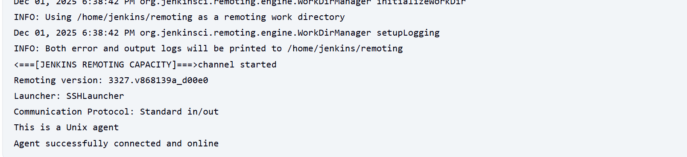
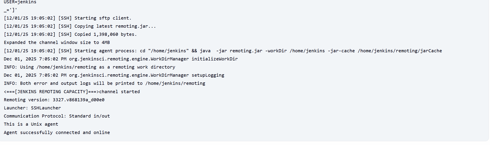
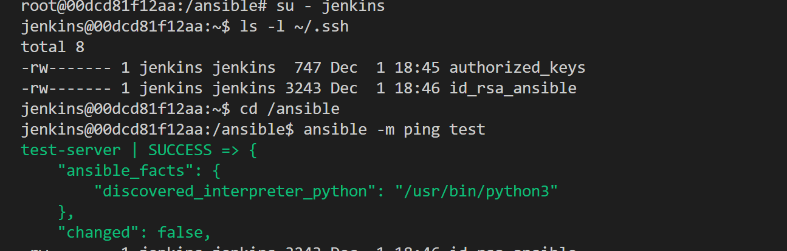
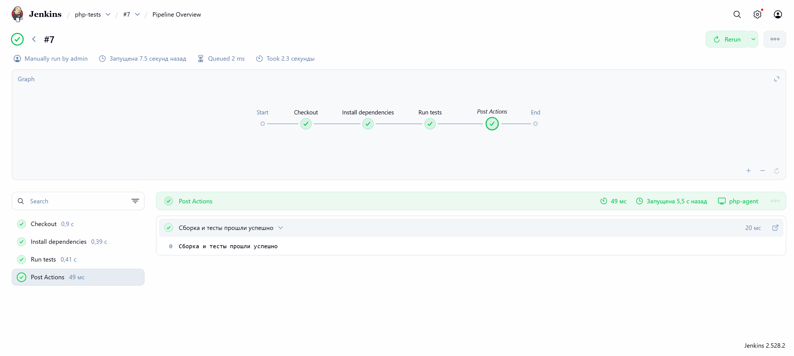
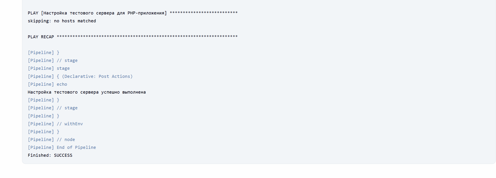
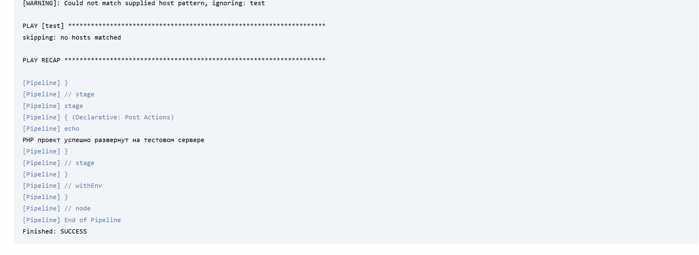
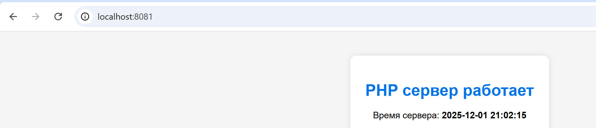

# Лабораторная работа 5. Ansible playbook для конфигурации сервера
# Студент: Gachayev Dmitrii, I2302
# Дата выполнения: 01.12.2025
# Цель
Научиться создавать Ansible playbook для автоматизации конфигурации серверов.

---

## 1. Установка и настройка Jenkins

Создаю следующий `compose.yml`:
```yml
services:
  jenkins-controller:
    image: jenkins/jenkins:lts-jdk17
    container_name: jenkins-controller
    restart: unless-stopped
    user: root
    ports:
      - "8080:8080" 
      - "50000:50000"
      - jenkins_home:/var/jenkins_home
      - /var/run/docker.sock:/var/run/docker.sock

  ssh-agent:
    build:
      context: .
      dockerfile: Dockerfile.ssh_agent
    container_name: jenkins-ssh-agent
    restart: unless-stopped
    ports:
      - "2222:22" 

volumes:
  jenkins_home:
```

## 2. Подготовка SSH агента

Создаю такой `Dockerfile.ssh_agent`:

```Dockerfile
FROM php:8.2-cli

RUN apt-get update && apt-get install -y \
    openssh-server \
    git \
    zip unzip \
 && rm -rf /var/lib/apt/lists/*


RUN useradd -m -d /home/jenkins -s /bin/bash jenkins


RUN mkdir -p /home/jenkins/.ssh && \
    chown -R jenkins:jenkins /home/jenkins/.ssh && \
    chmod 700 /home/jenkins/.ssh

COPY jenkins_agent_key.pub /home/jenkins/.ssh/authorized_keys
RUN chown jenkins:jenkins /home/jenkins/.ssh/authorized_keys && \
    chmod 600 /home/jenkins/.ssh/authorized_keys

RUN sed -i 's/#PasswordAuthentication yes/PasswordAuthentication no/' /etc/ssh/sshd_config && \
    sed -i 's/#PermitRootLogin prohibit-password/PermitRootLogin no/' /etc/ssh/sshd_config

RUN apt-get update && apt-get install -y \
    openssh-server \
    git \
    zip unzip \
    openjdk-21-jre \
  && rm -rf /var/lib/apt/lists/*
EXPOSE 22

CMD ["/usr/sbin/sshd", "-D"]
```

Настраиваю Agent и Node через Jenkins GUI и получаю сообщение об успехе:



## 3. Создание агента Ansible

Генерирую SSH ключи для Ansible агента:
```bash
ssh-keygen -t rsa -b 4096 -m PEM -f ansible_agent_key
```

Также создаю и для тестового сервера:
```bash
ssh-keygen -t rsa -b 4096 -m PEM -f ansible_test_key
```

Далее создаю `Dockerfile.ansible_agent`:
```dockerfile
FROM ubuntu:24.04

RUN apt-get update && apt-get install -y \
    python3 \
    python3-venv \
    ssh \
    openssh-server \
    git \
    vim \
    ansible \
    openjdk-21-jre \
  && rm -rf /var/lib/apt/lists/*

RUN useradd -m -d /home/jenkins -s /bin/bash jenkins

RUN mkdir -p /var/run/sshd

RUN mkdir -p /home/jenkins/.ssh && \
    chown -R jenkins:jenkins /home/jenkins/.ssh && \
    chmod 700 /home/jenkins/.ssh

COPY ansible_agent_key.pub /home/jenkins/.ssh/authorized_keys
RUN chown jenkins:jenkins /home/jenkins/.ssh/authorized_keys && \
    chmod 600 /home/jenkins/.ssh/authorized_keys

COPY ansible_test_key /home/jenkins/.ssh/id_rsa_ansible
RUN chown jenkins:jenkins /home/jenkins/.ssh/id_rsa_ansible && \
    chmod 600 /home/jenkins/.ssh/id_rsa_ansible

RUN sed -i 's/#PasswordAuthentication yes/PasswordAuthentication no/' /etc/ssh/sshd_config && \
    sed -i 's/#PermitRootLogin prohibit-password/PermitRootLogin no/' /etc/ssh/sshd_config

RUN mkdir -p /ansible && chown -R jenkins:jenkins /ansible

USER jenkins
WORKDIR /ansible

RUN echo '[defaults]\n' \
         'inventory = /ansible/hosts\n' \
         'remote_user = ansible\n' \
         'private_key_file = /home/jenkins/.ssh/id_rsa_ansible\n' \
         'host_key_checking = False\n' \
         > /ansible/ansible.cfg

RUN echo '[test]\n' \
         'test-server ansible_host=test-server\n' \
         > /ansible/hosts

USER root

EXPOSE 22
CMD ["/usr/sbin/sshd", "-D"]
```

Затем добавляю такой фрагмент в `compose.yml`:
```dockerfile
  ansible-agent:
    build:
      context: .
      dockerfile: Dockerfile.ansible_agent
    container_name: jenkins-ansible-agent
    restart: unless-stopped
    ports:
```

Далее создаю ноды и агенты под ansible, проверяю:



## 4. Создание тестового сервера
Создаю `Dockerfile.test_server`:
```dockerfile
FROM ubuntu:24.04

RUN apt-get update && \
    apt-get install -y openssh-server sudo && \
    mkdir /var/run/sshd

RUN useradd -m -s /bin/bash ansible && \
    echo "ansible ALL=(ALL) NOPASSWD: ALL" >> /etc/sudoers

RUN mkdir -p /home/ansible/.ssh && \
    chmod 700 /home/ansible/.ssh

COPY ansible_test_key.pub /home/ansible/.ssh/authorized_keys

RUN chmod 600 /home/ansible/.ssh/authorized_keys && \
    chown -R ansible:ansible /home/ansible/.ssh

EXPOSE 22

CMD ["/usr/sbin/sshd", "-D"]

```

Добавляю `test-server` в `compose.yml`:
```yml
  test-server:
    build:
      context: .
      dockerfile: Dockerfile.test_server
    container_name: test-server
    restart: unless-stopped
    ports:
      - "2223:22"
```

Провожу настройку портов и контейнера, проверяю подключение между ними:



## 5. Создание Ansible playbook для настройки тестового сервера

Создаю папку ansible, в ней файл `hosts.ini`:
```ini
[test]
test-server ansible_host=test-server ansible_user=ansible
```

Также создаю `setup_test_server.yml`:
```yml
---
- name: Настройка тестового сервера для PHP-приложения
  hosts: test
  become: true

  vars:
    app_root: /var/www/php_app
    server_name: test-server.local

  tasks:
    - name: Обновить кеш пакетов APT
      apt:
        update_cache: yes
        cache_valid_time: 3600

    - name: Установить Apache2
      apt:
        name: apache2
        state: present

    - name: Включить модули Apache (rewrite, php)
      command: a2enmod "{{ item }}"
      with_items:
        - rewrite
        - php
      notify: Restart Apache
      ignore_errors: yes

    - name: Установить PHP и необходимые расширения
      apt:
        name:
          - php
          - libapache2-mod-php
          - php-cli
          - php-mbstring
          - php-xml
          - php-mysql
        state: present

    - name: Создать директорию приложения
      file:
        path: "{{ app_root }}"
        state: directory
        owner: www-data
        group: www-data
        mode: "0755"

    - name: index.php (заглушка)
      copy:
        dest: "{{ app_root }}/index.php"
        content: |
          <?php
          phpinfo();
        owner: www-data
        group: www-data
        mode: "0644"

    - name: Создать конфигурацию виртуального хоста для PHP
      copy:
        dest: /etc/apache2/sites-available/php_app.conf
        content: |
          <VirtualHost *:80>
              ServerName {{ server_name }}
              DocumentRoot {{ app_root }}

              <Directory {{ app_root }}>
                  AllowOverride All
                  Require all granted
              </Directory>

              ErrorLog ${APACHE_LOG_DIR}/php_app_error.log
              CustomLog ${APACHE_LOG_DIR}/php_app_access.log combined
          </VirtualHost>
      notify: Restart Apache

    - name: Отключить дефолтный сайт Apache
      file:
        path: /etc/apache2/sites-enabled/000-default.conf
        state: absent
      notify: Restart Apache

    - name: Включить виртуальный хост php_app
      file:
        src: /etc/apache2/sites-available/php_app.conf
        dest: /etc/apache2/sites-enabled/php_app.conf
        state: link
      notify: Restart Apache

  handlers:
    - name: Restart Apache
      service:
        name: apache2
        state: restarted
```

## 6. Конвейер для сборки и тестирования PHP проекта

Создаю Pipeline через Jenkins GUI, со следующим `php_build_and_test_pipeline.groovy`:
```groovy
pipeline {
    agent { label 'php-agent' }

    environment {
        GIT_REPO_URL = 'https://github.com/zzzzzzqwe/automation_and_scripting.git'
        GIT_BRANCH   = 'main'
        PHP_APP_PATH = 'Lab05/web/tests'
    }

    stages {
        stage('Checkout') {
            steps {
                echo "Клонирую репозиторий ${env.GIT_REPO_URL} (${env.GIT_BRANCH})"
                git branch: env.GIT_BRANCH, url: env.GIT_REPO_URL

                echo "Содержимое рабочего каталога после checkout:"
                sh 'pwd && ls -la'
            }
        }

        stage('Install dependencies') {
            steps {
                echo "Пробую установить зависимости через Composer (если есть composer.json)"
                dir(env.PHP_APP_PATH) {
                    sh '''
                        if [ -f "composer.json" ]; then
                          echo "Найден composer.json — выполняю composer install"
                          composer install --no-interaction --no-progress --prefer-dist
                        else
                          echo "composer.json не найден — пропускаю шаг установки зависимостей"
                        fi
                    '''
                }
            }
        }

        stage('Run tests (PHPUnit или tests.php)') {
            steps {
                echo "Запускаю тесты проекта"
                dir(env.PHP_APP_PATH) {
                    sh '''
                        if [ -x "vendor/bin/phpunit" ]; then
                          echo "Запускаю vendor/bin/phpunit"
                          ./vendor/bin/phpunit --testdox
                          exit $?
                        fi

                        if command -v phpunit >/dev/null 2>&1; then
                          echo "Запускаю глобальный phpunit"
                          phpunit --testdox
                          exit $?
                        fi

                        if [ -f "tests.php" ]; then
                          echo "PHPUnit не найден, запускаю tests.php"
                          php tests.php
                          exit $?
                        fi

                        echo "Не найден ни PHPUnit, ни tests.php — нечего запускать"
                        exit 1
                    '''
                }
            }
        }
    }

    post {
        success {
            echo "Сборка и тесты прошли успешно"
        }
        failure {
            echo "Сборка или тесты завершились с ошибкой"
        }
    }
}
```

Спустя множество времени и деббагинга пайплайн проходит и запускает тесты



## 7. Конвейер для настройки тестового сервера с помощью Ansible

Создаю следующий файл:
```groovy
pipeline {
    agent { label 'ansible-agent' }

    environment {
        GIT_REPO_URL = "https://github.com/zzzzzzqwe/automation_and_scripting.git"
        GIT_BRANCH   = "main"
        PLAYBOOK_PATH = "Lab05/ansible/setup_test_server.yml"
        INVENTORY_PATH = "/ansible/inventory/hosts"
    }

    stages {
        stage('Checkout playbook') {
            steps {
                echo "Клонирую репозиторий с Ansible playbook"
                git branch: env.GIT_BRANCH, url: env.GIT_REPO_URL

                echo "Содержимое каталога:"
                sh "pwd && ls -la"
            }
        }

        stage('Run Ansible playbook') {
            steps {
                echo "Запускаю Ansible playbook ${env.PLAYBOOK_PATH}"
                sh """
                    ansible-playbook ${env.PLAYBOOK_PATH} -i ${env.INVENTORY_PATH}
                """
            }
        }
    }

    post {
        success { echo "Настройка тестового сервера успешно выполнена" }
        failure { echo "Ошибка при настройке тестового сервера" }
    }
}
```

Создаю Pipeline через Jenkins GUI и добиваюсь успешного выполнения:



## 8. Конвейер для размещения PHP проекта на тестовом сервере
Создаю следующий файл:
```groovy
pipeline {
    agent { label 'ansible-agent' }

    environment {
        GIT_REPO_URL = "https://github.com/zzzzzzqwe/automation_and_scripting.git"
        GIT_BRANCH   = "main"
        PROJECT_PATH = "Lab05/web"
        INVENTORY_PATH = "/ansible/inventory/hosts"
        PLAYBOOK_DEPLOY = "/ansible/deploy_php.yml"
    }

    stages {
        stage('Checkout PHP project') {
            steps {
                echo "Клонирую репозиторий PHP проекта"
                git branch: env.GIT_BRANCH, url: env.GIT_REPO_URL

                echo "Содержимое каталога:"
                sh "pwd && ls -la"
            }
        }

        stage('Prepare Project Directory') {
            steps {
                echo "Копирую PHP проект во временную директорию"
                sh """
                    rm -rf /ansible/project
                    mkdir -p /ansible/project
                    cp -r ${env.PROJECT_PATH}/* /ansible/project/
                """
            }
        }

        stage('Deploy to Test Server') {
            steps {
                echo "Запускаю Ansible playbook для деплоя"
                sh """
                    ansible-playbook ${env.PLAYBOOK_DEPLOY} -i ${env.INVENTORY_PATH}
                """
            }
        }
    }

    post {
        success { echo "PHP проект успешно развернут на тестовом сервере" }
        failure { echo "Ошибка при деплое PHP проекта" }
    }
}
```

Также спустя несколько фиксов пайплан выполняется успешно:



## 9. Тестирование размещенного PHP проекта

Так как данный проект представляет собой просто тестовый фреймворк, я добавлю минимальный фронтенд для проверки:
```php
<!DOCTYPE html>
<html lang="ru">
<head>
    <meta charset="UTF-8">
    <title> PHP project</title>
    <style>
        body {
            background: #f5f5f5;
            font-family: Arial, sans-serif;
            padding: 40px;
            text-align: center;
        }
        .box {
            background: white;
            padding: 30px;
            border-radius: 12px;
            box-shadow: 0 0 10px rgba(0,0,0,0.1);
            display: inline-block;
            min-width: 300px;
        }
        h1 { color: #0073e6; }
        p { font-size: 18px; }
    </style>
</head>
<body>
    <div class="box">
        <h1>PHP сервер работает</h1>
        <p>Время сервера: <b><?php echo date("Y-m-d H:i:s"); ?></b></p>
    </div>
</body>
</html>
```

Перехожу на http://localhost:8081/ и вижу рабочий проект:



# Контрольные вопросы

> Какие преимущества использования Ansible для настройки серверов?

Автоматизация без агентов, простой YAML-синтаксис, идемпотентность задач, удобное масштабирование, единый инструмент для конфигурации, деплоя и оркестрации

> Какие еще бывают модули Ansible для управления конфигурацией?

file, copy, apt/yum, service, systemd, template, user, command/shell, git, unarchive, lineinfile, ufw, docker, mysql/postgresq

> Какие проблемы вы столкнулись при создании Ansible playbook и как вы их решили?

- неверные пути к файлам - исправил правильные абсолютные пути внутри контейнера;
- отсутствие необходимых прав - выставил нужных владельцев и chmod;
- ошибки структуры playbook - поправил YAML-синтаксис;
- неверный инвентори - скорректировал hosts и ключи SSH.

# Вывод
В ходе работы была развернута CI/CD-среда на базе Jenkins, SSH-агентов и Ansible. Настроены Docker-контейнеры, PHP-агенты, Ansible-агенты и тестовый сервер. Реализованы конвейеры для сборки, тестирования и деплоя PHP-проекта, а также playbook для автоматической конфигурации сервера.